# Insight Delivery Pipeline: From Code to Developer Action

## Overview

This document visualizes the complete pipeline of how Shannon Insight with PRIMITIVE_REDESIGN delivers actionable insights to developers through multiple channels.

---

## Pipeline Architecture

```mermaid
graph TD
    subgraph "Code Sources"
        A[Source Code<br/>Python, Go, TS, JS] --> B[Scanners<br/>Language-specific]
    end

    subgraph "Analysis Layer"
        B --> C[FileMetrics<br/>functions, complexity,<br/>imports, exports]
        C --> D[PrimitiveExtractor<br/>Compute 3 New Metrics]
        D --> E{New Metrics}
        E -->|Compression<br/>complexity|F[Compression Class]
        E -->|Identifier<br/>coherence|G[IdentifierAnalyzer]
        E -->|Gini-enhanced<br/>cognitive load|H[Gini Class]
        F --> I[Raw Metric Values]
        G --> I
        H --> I
    end

    subgraph "Analysis Layer (continued)"
        I --> J[Detector<br/>Anomaly Detection]
        J --> K[Fusion Engine<br/>Signal Combination]
        K --> L[Normalized Scores<br/>Z-scores]
    end

    subgraph "Insight Generation"
        L --> M[Recommendation Engine<br/>Generate Actionable Insights]
        M --> N[Insight Formatter<br/>Multi-channel Output]
    end

    subgraph "Delivery Channels"
        N --> O[CLI Output<br/>Terminal]
        N --> P[IDE Integration<br/>VS Code Plugin<br/>Real-time Gutter Hints]
        N --> Q[Dashboard<br/>Web UI<br/>Historical Trends]
        N --> R[CI/CD Integration<br/>PR Comments<br/>Quality Gates]
        N --> S[Documentation<br/>Auto-generated Guides]
    end

    subgraph "Developer Action"
        O --> T[Developer Sees<br/>Generic Warnings<br/>(CURRENT)]
        P --> U[Developer Sees<br/>Specific Insights<br/>WITH LINE NUMBERS<br/>(AFTER)]
        Q --> U
        R --> V[Developer Reviews<br/>Before/After<br/>Comparisons]
        S --> V
    end

    subgraph "Feedback Loop"
        T -->|Ignored<br/>Low Trust|W[False Positive Report]
        U -->|Acted Upon<br/>High Trust|X[Success Metrics<br/>Compression/Coherence/Gini Improved]
        V --> Y[Override/Adaptation<br/>Threshold Tuning]
        W --> Z[Learning System<br/>Reduce False Positives]
        X --> Z
        Y --> Z
    end

    style A fill:#e1f5e3
    style B fill:#f4a261
    style C fill:#c0caf5
    style D fill:#67b7e1
    style E fill:#ff6b6b
    style F fill:#2ecc71
    style G fill:#3498db
    style H fill:#9b59b6
    style I fill:#e74c3c
    style J fill:#34495e
    style K fill:#e67e22
    style L fill:#f39c12
    style M fill:#e84393
    style N fill:#3498db
    style O fill:#e74c3c
    style P fill:#2ecc71
    style Q fill:#2ecc71
    style R fill:#2ecc71
    style S fill:#2ecc71
    style T fill:#e74c3c
    style U fill:#2ecc71
    style V fill:#2ecc71
    style W fill:#f39c12
    style X fill:#2ecc71
    style Y fill:#3498db
    style Z fill:#27ae60
```

---

## Detailed Pipeline Stages

### Stage 1: Code Ingestion

```
┌─────────────────────────────────────────────┐
│         Code Sources                    │
│                                         │
│  ┌──────────┐  ┌──────────┐  │
│  │  Python   │  │   Go      │  │
│  └────┬─────┘  └────┬─────┘  │
│       │                │           │
│  ┌────▼────────────▼─────┐        │
│  │    Scanner Pool     │        │
│  │    (Language-          │        │
│  │     Specific)         │        │
│  └────┬─────────────────┘        │
│       │                           │
│       ▼                           │
│  ┌─────────────────────┐         │
│  │   FileMetrics      │         │
│  │   (functions,       │         │
│  │    complexity,      │         │
│  │    imports,         │         │
│  │    exports,         │         │
│  │    function_sizes)  │         │
│  └────────┬────────────┘         │
└─────────┼───────────────────────────┘
          │
          ▼
```

**Input:** Source code files (`.py`, `.go`, `.ts`, `.js`)

**Process:**
1. **Language detection** → Auto-detect or manual (`--language`)
2. **Scanner selection** → Language-specific scanner (PythonScanner, GoScanner, etc.)
3. **Code parsing** → Extract AST nodes, imports, exports, function sizes
4. **Metrics extraction** → Build `FileMetrics` object

**Output:** List of `FileMetrics` objects (one per file)

---

### Stage 2: Primitive Computation

```
┌─────────────────────────────────────────────────────────┐
│         Primitive Extraction Engine           │
│                                                 │
│  FileMetrics                                    │
│       │                                         │
│       ▼                                         │
│  ┌─────────────────────────────────────────┐       │
│  │     New PRIMITIVE_REDESIGN Metrics   │       │
│  │                                      │       │
│  │  ┌────────┐  ┌────────┐  ┌─────┐ │       │
│  │  │Compression│  │Identifier│  │Gini │ │       │
│  │  │ Class    │  │Analyzer │  │Class│ │       │
│  │  │          │  │         │  │     │ │       │
│  │  │compute   │  │extract  │  │gini│ │       │
│  │  │ratio()   │  │tokens() │  │coef│ │       │
│  │  └────┬─────┘  └────┬─────┘  └───┬┘ │       │
│  │       │              │        │        │   │       │
│  └───────┼──────────────┼────────┴────────┘   │       │
│          │              │                  │       │
│          ▼              ▼                  ▼       │
│  ┌─────────────────────────────────────┐       │
│  │   Raw Metric Values               │       │
│  │   (compression_ratio,             │       │
│  │    identifier_coherence,          │       │
│  │    gini_coefficient,             │       │
│  │    enhanced_cognitive_load)      │       │
│  └──────────────────────┬────────────┘       │
└─────────────────────────┼───────────────────────────┘
                      │
                      ▼
```

**Three New Metrics:**

#### 2.1 Compression-Based Complexity

```python
# math/compression.py

Input: File content (bytes)
Process:
  1. Check minimum size threshold (≥512 bytes)
  2. Compress with zlib (level=9)
  3. Calculate ratio: compressed_size / original_size
  4. Return: ratio in [0, 1]

Calibration:
  - < 0.20: Highly repetitive (duplication)
  - 0.20-0.45: Normal complexity
  - 0.45-0.65: Dense/complex
  - > 0.65: Very dense

Example Output:
  complex.go → compression_ratio = 0.41 (dense)
  simple.go → compression_ratio = 0.28 (normal)
```

#### 2.2 Identifier-Based Coherence

```python
# math/identifier.py

Input: File content (text)
Process:
  1. Extract identifiers: re.findall(r'[a-zA-Z_]\w{2,}', content)
  2. Filter stop words: def, class, import, return, if, etc.
  3. Split camelCase: validateEmail → [validate, email]
  4. Split snake_case: user_email → [user, email]
  5. Compute TF-IDF on semantic tokens
  6. Cluster with K-means (3-8 clusters)
  7. Calculate coherence: inverse of cluster entropy

Example Output:
  complex.go → 3 responsibility clusters detected
    - Cluster 1: {strings, toupper, tolower} at lines 15-22
    - Cluster 2: {calculate, metric, switch} at lines 34-49
    - Cluster 3: {process, result} at lines 14-32
    - Coherence: 0.35 (low - mixed concerns)
```

#### 2.3 Gini-Enhanced Cognitive Load

```python
# math/gini.py

Input: function_sizes: List[int] (from FileMetrics)
Process:
  1. Sort function sizes
  2. Compute cumulative: Σ(i × function_size_i)
  3. Apply formula: G = (2 × cumulative) / (n × total) - (n + 1) / n
  4. Clamp to [0, 1]
  5. Apply concentration penalty: load × (1 + Gini)

Calibration:
  - < 0.30: Even distribution (healthy)
  - 0.30-0.60: Moderate inequality (some large functions)
  - 0.60-0.80: High inequality (god functions)
  - > 0.80: Severe inequality

Example Output:
  complex.go → Gini = 0.78 (severe)
    - Function VeryComplexFunction: 23 lines (25× median)
    - Concentration penalty: 1.78
    - Enhanced cognitive load: base × 1.78
```

---

### Stage 3: Normalization & Anomaly Detection

```
┌─────────────────────────────────────────────────┐
│    Detection Engine                    │
│                                        │
│  Raw Metrics                            │
│       │                                │
│       ▼                                │
│  ┌─────────────────────────────────┐       │
│  │   Z-Score Normalization       │       │
│  │                            │       │
│  │  z = (x - μ) / σ          │       │
│  │                            │       │
│  │  Output:                    │       │
│  │  - compression_z = +1.85σ    │       │
│  │  - coherence_z = +1.62σ      │       │
│  │  - gini_load_z = +2.43σ      │       │
│  │                            │       │
│  └────┬─────────────────────┘       │
│       │                          │       │
│       ▼                          │       │
│  ┌─────────────────────────────────┐       │
│  │   Anomaly Detection         │       │
│  │                            │       │
│  │  IF |z| > threshold:     │       │
│  │    Flag as anomaly        │       │
│  │                            │       │
│  │  Thresholds:              │       │
│  │  - compression: 1.5         │       │
│  │  - coherence: 1.5           │       │
│  │  - gini: 1.5               │       │
│  │                            │       │
│  └────┬─────────────────────┘       │
└─────────────┼─────────────────────────────┘
            │
            ▼
```

**Normalization:**
- Convert raw metrics to Z-scores (mean=0, std=1)
- Enables cross-metric comparison
- Consistent across files

**Anomaly Detection:**
- Apply threshold to each primitive
- Use direction from registry (high_is_bad, low_is_bad, both_extreme_bad)
- Generate anomaly flags

---

### Stage 4: Insight Generation

```
┌───────────────────────────────────────────────────────────┐
│       Recommendation Engine                     │
│                                                 │
│  Normalized Scores                               │
│       │                                         │
│       ▼                                         │
│  ┌─────────────────────────────────────────────┐       │
│  │   Signal Fusion (Weighted Sum)          │       │
│  │                                        │       │
│  │  overall = Σ(weight_i × score_i)        │       │
│  │                                        │       │
│  │  Weights:                             │       │
│  │  - compression: 0.25                  │       │
│  │  - coherence: 0.25                   │       │
│  │  - gini_load: 0.35                   │       │
│  │  - centrality: 0.10                   │       │
│  │  - volatility: 0.05                   │       │
│  │                                        │       │
│  └────┬─────────────────────────────┘       │
│       │                                  │       │
│       ▼                                  │       │
│  ┌─────────────────────────────────────────┐       │
│  │   Insight Generator                 │       │
│  │                                 │       │
│  │  FOR EACH ANOMALY:              │       │
│  │                                 │       │
│  │  Answer 5 Questions:            │       │
│  │  - WHERE (exact location?)       │       │
│  │  - WHY (impact to dev?)         │       │
│  │  - HOW (specific action?)        │       │
│  │  - WHEN (priority?)             │       │
│  │  - VERIFY (success criteria?)    │       │
│  │                                 │       │
│  │  Generate:                     │       │
│  │  - Root cause description       │       │
│  │  - Actionable recommendations     │       │
│  │  - Expected outcomes           │       │
│  │  - Verification metrics        │       │
│  │                                 │       │
│  └────┬───────────────────────────┘       │
└─────────────┼───────────────────────────────────┘
              │
              ▼
```

---

### Stage 5: Multi-Channel Delivery

```
                    ┌─────────────────────────────────┐
                    │   Insight Formatter    │
                    │                            │
                    │  ┌──────────────────┐  │
                    │  │   Formatted      │  │
                    │  │   Insights      │  │
                    │  └────┬─────┬─────┘  │
                    └───────┼─────┼──────┘
                            │     │     │
                    ┌───────────┼─────┼───────────┐
                    │           │     │           │
            ┌───────────▼────┐     │           │
            │                 │     │           │
    ┌───────▼──────┐  ┌─────▼──────┐  │
    │                │  │             │  │
┌───▼────────┐  ┌──────▼──────┐  ┌──────▼──────┐  ┌────▼─────┐
│            │  │              │  │             │  │
│  CLI Output  │  │   IDE         │  │   Dashboard  │  │ CI/CD     │
│  (Terminal) │  │   Integration │  │   (Web UI)   │  │  (PR/Build) │
│            │  │   (VS Code)   │  │             │  │             │
│  - Rich     │  │   - Gutter    │  │   - Trends   │  │  - PR       │
│    text     │  │     hints     │  │   - Drill-    │  │    comments │
│    table    │  │   - Tooltips   │  │     down     │  │  - Quality   │
│    JSON     │  │   - Quick fix │  │     charts   │  │    gates    │
│            │  │             │  │             │  │             │
│            │  │             │  │             │  │             │
└────────────┘  └─────────────┘  └─────────────┘  └─────────────┘  └─────────────┘
```

#### Channel 1: CLI Output

**Use case:** Ad-hoc analysis, CI/CD scripting

**Format:** Rich terminal output with colors and tables

```
╭──────────────────────────────────────────────────────────────╮
│                 Top 3 Files Requiring Attention          │
┏━━━━━━┳━━━━━━━━━━━━━━━━━━━━━━━━━━━┳━━━━━━━━━━┳━━━━━━━━━━━━━━━━━┓
┃ #    ┃ File               ┃ Score ┃ Confidence ┃ Issue             ┃
┡━━━━━━╇━━━━━━━━━━━━━━━━━━━━━━━━━━━╇━━━━━━━━━━╇━━━━━━━━━━━━━━━━━┩
│ 1    │ complex.go         │ 0.590 │ 0.51       │ Gini: 0.78      │
│      │                          │          │              │ God function      │
┃      │                          │          │              │ Lines 61-83     │
│ 2    │ processor.py       │ 0.485 │ 0.47       │ Coherence: 0.35 │
│      │                          │          │              │ 3 clusters     │
└──────┴──────────────────────────┴──────────┴──────────────┴─────────────────┘

Recommendations:
  1. Extract VeryComplexFunction (lines 61-83):
     - Current: 23 lines (38% of file)
     - Action: Extract nested loops into calculateNestedTotals()
     - Expected: Gini 0.78 → < 0.30

  2. Extract string processing cluster:
     - Lines 15-22: strings.ToUpper(), strings.ToLower()
     - Action: Move to string_utils.go
     - Expected: Coherence 0.35 → > 0.80

Verification:
  - After refactoring, run: shannon --explain complex.go
  - Check: Gini < 0.30 ✓
  - Check: Coherence > 0.80 ✓
```

#### Channel 2: IDE Integration (VS Code)

**Use case:** Real-time feedback as developer writes code

**Components:**
1. **Gutter Icons** - Color-coded indicators
2. **Tooltips** - Hover for details
3. **Quick Fix** - One-click refactoring
4. **Proactive Hints** - Before explicit request

```
┌────────────────────────────────────────────────────────┐
│         VS Code Editor Window                     │
│                                                 │
│  ┌─────────────────────────────────────────┐       │
│  │       complex.go                  │       │
│  │  package main                        │       │
│  │                                     │       │
│  │  1 func VeryComplexFunction() {      │       │
│  │  14     total := 0                   │    ⚠  <-- Gutter Icon
│  │  15     for i := 0; i < x; i++ {│       │       │
│  │  16         for j := 0; j < y; j++ {│       │       │
│  │  17             for k := 0; k < z; k++ {│       │       │
│  │  18  ━━━━━━━━━━━━━━━━━━━━━━━━━━━━│    <-- Hover Tooltip
│  │  19                 if i > 0 {            │    "Function is 23 lines"
│  │  │                     │                  │    "(25× median size)"
│  │  │                     │                  │    "Click to extract"
│  │  │                     │                  │
│  │  │                     │    [💡 Quick Fix]    <-- One-click action
│  │  │                     │                  │
│  │  │                     │                  │
│  │  18         }                            │       │
│  │  17       }                             │       │
│  │  16   }                               │       │
│  │  15 }                                 │       │
│  │  14 }                                   │       │
│  └─────────────────────────────────────────┘       │
│                                                 │
│  Bottom Panel:                                  │
│  ┌─────────────────────────────────┐           │
│  │ Shannon Insights Panel        │           │
│  │                           │           │
│  │ File: complex.go            │           │
│  │ ─────────────────────────    │           │
│  │ ⚠ Gini: 0.78 (HIGH)   │           │
│  │   God function detected     │           │
│  │   Line: VeryComplexFunction   │           │
│  │   (lines 61-83, 23 lines)  │           │
│  │                          │           │
│  │ 💡 Recommendation:       │           │
│  │   Extract nested loops     │           │
│  │   into helper:            │           │
│  │   calculateNestedTotals() │           │
│  │   [One-click Extract] ──┘           │
└────────────────────────────────────────────────┘
```

**Latency:** < 100ms for file-level insights

#### Channel 3: Dashboard (Web UI)

**Use case:** Project-wide health, historical trends, prioritization

```
┌───────────────────────────────────────────────────────────────────────────┐
│                    Shannon Insight Dashboard                            │
│                                                                    │
│  ┌─────────────────────────────────────────────────────────────┐         │
│  │                 Project Health                      │         │
│  │                                                          │         │
│  │  ┌────────┐  ┌──────────┐  ┌─────────────┐    │         │
│  │  │ Files  │  │ Insights  │  │   Trends    │    │         │
│  │  │ 8      │  │   3      │  │  30-day     │    │         │
│  │  │        │  │ anomalous │  │             │    │         │
│  │  │        │  │           │  │             │    │         │
│  │  └────────┘  └────┬──────┘  └────┬────────┘    │         │
│  │                   │           │        │            │         │
│  │  Riskiest Files      │           │        │            │         │
│  │                   │           │        │            │         │
│  │  ┏━━━━━━━━━━━━━━━━━━━━━┓ │           │        │            │         │
│  │  ┃ 1. complex.go   0.59  │ │           │        │            │         │
│  │  ┃ 2. processor.py  0.49  │ │           │        │            │         │
│  │  ┃ 3. validator.go  0.47  │ │           │        │            │         │
│  │  ┗━━━━━━━━━━━━━━━━━━━━━┛ │           │        │            │         │
│  │                   │           │        │            │         │
│  └──────────────────────────┘           │        │            │         │
│                                       │        │            │         │
│  ┌─────────────────────────────────────┐   │        │            │         │
│  │   File Detail: complex.go          │   │        │            │         │
│  │                               │   │        │            │         │
│  │  Compression Ratio Trend:       │   │        │            │         │
│  │  0.65 ──┼─ 0.59 ──┼─ 0.52 ──→│   │        │            │         │
│  │     (Jan)   (Feb)   (Mar)   (Apr) │   │        │            │         │
│  │                               │   │        │            │         │
│  │  Gini Coefficient: 0.78     │   │        │            │         │
│  │  ━━━━━━━━━━━━━━━━━━━━━━ 80%    │   │        │            │         │
│  │                               │   │        │            │         │
│  │  Responsibility Clusters:       │   │        │            │         │
│  │  Cluster 1: String Processing   │   │        │            │         │
│  │    - Lines 15-22              │   │        │            │         │
│  │    - Tokens: {strings, toupper, tolower}│   │        │            │         │
│  │    - Action: [Extract Module]   │   │        │            │         │
│  │                               │   │        │            │         │
│  │  Cluster 2: Logic/Math        │   │        │            │         │
│  │    - Lines 34-49              │   │        │            │         │
│  │    - Tokens: {calculate, metric, switch}│   │        │            │         │
│  │    - Action: [Extract Module]   │   │        │            │         │
│  │                               │   │        │            │         │
│  └─────────────────────────────┘   │        │            │         │
│                                       │        │            │         │
└───────────────────────────────────────────────────────────────────┘
```

**Features:**
- Historical trend charts (30/60/90 days)
- Drill-down to file details
- Team-level metrics (riskiest developer, healthiest module)
- Export to PDF/JSON

#### Channel 4: CI/CD Integration

**Use case:** Code review gates, prevent bad code from merging

```
┌─────────────────────────────────────────────────────────────────┐
│                   Pull Request #1234: Refactor user processor       │
│                                                                │
│  ┌──────────────────────────────────────────────────────┐         │
│  │          Shannon Insight Quality Gate          │         │
│  │                                            │         │
│  │  Status: ❌ BLOCKED - Quality threshold exceeded         │         │
│  │                                            │         │
│  │  Thresholds:                               │         │
│  │  • Gini coefficient: ≤ 0.60               │         │
│  │  • Compression ratio: ≤ 0.50                │         │
│  │  • Identifier coherence: ≥ 0.40                │         │
│  │                                            │         │
│  │  Current Values:                            │         │
│  │  • Gini: 0.78 ❌ EXCEEDS THRESHOLD        │         │
│  │  • Compression: 0.41 ❌ EXCEEDS THRESHOLD    │         │
│  │  • Coherence: 0.35 ❌ EXCEEDS THRESHOLD     │         │
│  │                                            │         │
│  │  Files Failing Quality Gate:                │         │
│  │  ┏━━━━━━━━━━━━━━━━━━━━━━━┓             │         │
│  │  ┃ complex.go  processor.go  validator.go  ┃             │         │
│  │  ┃    0.78       0.65       0.72     ┃             │         │
│  │  ┃    ❌          ❌          ❌        ┃             │         │
│  │  ┗━━━━━━━━━━━━━━━━━━━━━━━┛             │         │
│  │                                            │         │
│  │  🔧 Recommendations:                     │         │
│  │  1. Extract VeryComplexFunction from complex.go      │         │
│  │     - Current: Lines 61-83, 23 lines         │         │
│  │     - Extract: calculateNestedTotals()         │         │
│  │     - Expected: Gini 0.78 → < 0.30          │         │
│  │                                            │         │
│  │  💡 [View Detailed Report]  [Override & Merge]  │         │
│  └──────────────────────────────────────────────────┘         │
│                                            │         │
└────────────────────────────────────────────────────────────┘
```

**Actions:**
- **Block** PR from merging if thresholds exceeded
- Add inline comments to PR with specific issues
- Provide "View Detailed Report" link to dashboard
- Allow "Override & Merge" with justification

---

### Stage 6: Feedback Loop

```
┌─────────────────────────────────────────────────────────────┐
│           Learning System & Trust Building               │
│                                                 │
│  Developer Action                                │
│       │                                         │
│       ▼                                         │
│  ┌────────────┴────────────┐                     │
│  │                     │     │               │
│  │   Ignored Insight  │  Acted Upon      │     │               │
│  │   │              │  │               │     │               │
│  │  │              │  │               │     │               │
│  │  ▼              │  ▼               │     ▼               │
│  │  ┌────────────┐  │  ┌──────────────┐  │  ┌───────────────┐ │
│  │  │ False      │  │  │  Success      │  │  │     Override/  │ │
│  │  │ Positive    │  │  │  Metrics      │  │  │     Adaptation │ │
│  │  │ Report     │  │  │              │  │  │             │ │
│  │  └──────┬─────┘  │  │  - Did Gini   │  │  │  - Threshold │ │
│  │       │            │  │    improve?    │  │  │   tunings?    │ │
│  │       │            │  │  - Did compression│  │  │             │ │
│  │       │            │  │      ratio      │  │  │             │ │
│  │       │            │  │    improve?    │  │  │             │ │
│  │       │            │  │  - Did coherence│  │  │             │ │
│  │       │            │  │    improve?    │  │  │             │ │
│  │       │            │  │               │  │  │             │ │
│  │       ▼            │  ▼               │  ▼               │
│  │  ┌─────────────────────────┐      │     ┌───────────────┐     │
│  │  │ Update Adaptive    │      │     │  Update False  │     │
│  │  │ Thresholds       │      │     │  Positive Detector │     │
│  │  │                  │      │     │                 │     │
│  │  │                  │      │     │ - Reduce future  │     │
│  │  │                  │      │     │   occurrences     │     │
│  │  │                  │      │     │   of this pattern  │     │
│  │  └─────────────────────┘      │     └───────────────┘     │
└─────────────────────────────────────────────────────┴──────────────────────┴────────────────┘
```

**Feedback Mechanisms:**

1. **False Positive Report**
   - Developer clicks "Not an issue" on insight
   - System logs: file, metric value, why it was flagged
   - Pattern: After 5+ "not an issue" clicks, reduce threshold for similar files

2. **Success Metrics**
   - Developer completes refactoring
   - Runs `shannon` again
   - System compares before/after values
   - If improvement confirmed: Mark as "good recommendation"
   - Track improvement patterns to refine guidance

3. **Threshold Adaptation**
   - Team configures thresholds for their context
   - System learns from overrides
   - Adaptive: Start with default, adjust based on team patterns
   - Example: "For our team, Gini > 0.80 is critical" (default is 0.70)

---

## Complete End-to-End Example

### Developer Workflow: Fixing complex.go

```
┌─────────────────────────────────────────────────────────┐
│         Developer Experience                        │
│                                                 │
│  1. Developer writes code in VS Code               │
│                                                 │
│  ┌─────────────────────────────────────┐           │
│  │   complex.go                        │           │
│  │  14 func VeryComplexFunction() {      │           │
│  │  15     total := 0                   │     ⚠  │
│  │  16     for i := 0; i < x; i++ {│           │
│  │  ...                                  │    "God function"   │
│  │  │                                     │    (23 lines)      │
│  │  │                                     │    "Lines 61-83"   │
│  │  │                                     │    [💡 Fix]         │
│  └─────────────────────────────────────┘           │
│                                                 │
│  2. Developer clicks [💡 Fix]               │
│                                                 │
│  ┌─────────────────────────────────────┐           │
│  │   Refactoring Wizard                │           │
│  │                               │           │
│  │  Extract VeryComplexFunction:      │           │
│  │  ┌───────────────────────┐       │           │
│  │  │ Extract to:            │       │           │
│  │  │   calculate_helper.go   │       │           │
│  │  │                       │       │           │
│  │  │  Method: calculateNestedTotals() │       │
│  │  │                       │       │           │
│  │  │  Current: Lines 61-83 │       │           │
│  │  │    Gini: 0.78             │       │           │
│  │  │    Extraction: Lines 67-80 │       │           │
│  │  │    Expected: Gini < 0.30   │       │
│  │  │                       │       │           │
│  │  │  [Extract & Create PR]    │       │           │
│  │  └───────────────────────┘       │           │
│  └─────────────────────────────────────┘           │
│                                                 │
│  3. Refactoring executes (VS Code API)           │
│                                                 │
│  ┌─────────────────────────────────────┐           │
│  │   complex.go (AFTER)               │           │
│  │  14 func VeryComplexFunction() {      │           │
│  │  15     // Delegated to helper     │           │
│  │  16     totals := calculateNestedTotals(...)  │           │
│  │  17     // ...                  │           │
│  │  │                            │           │
│  │  81 func calculateNestedTotals() {   │    ✅   │
│  │  82     // Extracted from VCF     │    "Fixed"  │
│  │  83 }                            │           │
│  └─────────────────────────────────────┘           │
│                                                 │
│  4. Dashboard auto-runs analysis           │
│                                                 │
│  ┌─────────────────────────────────────┐           │
│  │   File: complex.go                  │           │
│  │   ─────────────────────────    │           │
│  │   Gini: 0.78 → 0.28 ✅     │    "IMPROVED" │
│  │   Compression: 0.41 → 0.35 ✅   │           │
│  └─────────────────────────────────────┘           │
│                                                 │
│  5. Success metrics recorded                  │
│  - Developer completed refactoring (✓)
│  - Gini improved by 64% (✓)
│  - Confidence in recommendation increased (✓)
│  - Future similar insights will use this pattern
└─────────────────────────────────────────────────┘
```

---

## Pipeline Performance

| Stage | Latency | Throughput | Notes |
|--------|----------|-------------|--------|
| Scanning | 50-200ms/file | 1000 files/min | Language-specific |
| Metric Extraction | 10-50ms/file | 5000 files/min | Compression, Gini fast |
| Normalization | 5-20ms/file | 10000 files/min | Z-score computation |
| Insight Generation | 1-5ms/file | 20000 files/min | Template-based |
| CLI Output | < 100ms | Instant | Text formatting |
| IDE Integration | < 100ms | Real-time | Local cache |
| Dashboard UI | 200-500ms | 500 req/s | Web service |
| CI/CD Check | 1-5s | 100 checks/min | Full analysis |
| **Total E2E** | ~1s/file | 1000 files/min | End-to-end |

---

## Integration Points

### Developer Tools

```mermaid
graph LR
    subgraph "Developer Toolchain"
        A[VS Code] --> B[Shannon Extension]
        C[Git CLI] --> D[shannon Command]
        E[GitHub Actions] --> F[CI Check]
        G[Jenkins/TeamCity] --> F
    end

    subgraph "Shannon Insight"
        B --> H[Analysis Engine]
        D --> H
        F --> H
    end

    subgraph "Feedback"
        H --> I[Success Metrics]
        I --> J[Threshold Adaptation]
        J --> B
    end

    style A fill:#007acc
    style C fill:#f05032
    style E fill:#24292e
    style G fill:#339933
```



---

## Success Metrics

**Technical Metrics:**
- **Latency:** < 1s E2E for file-level insights
- **Throughput:** > 1000 files/min
- **Availability:** 99.9% uptime (dashboard)

**Adoption Metrics:**
- **Active users:** > 60% of installed weekly
- **Insights viewed:** > 40% of generated
- **Insights acted upon:** > 30% of viewed

**Quality Metrics:**
- **False positive rate:** < 5%
- **Recommendation success rate:** > 70% lead to measurable improvement
- **Developer satisfaction:** > 4/5 stars

---

## Summary

The PRIMITIVE_REDESIGN pipeline delivers insights through 4 channels:

1. **CLI** - Ad-hoc analysis, CI/CD scripts
2. **IDE** - Real-time feedback as code is written
3. **Dashboard** - Historical trends, team metrics
4. **CI/CD** - Quality gates, prevent bad code merging

Each channel provides the same high-quality, specific, actionable insights with:
- Exact line numbers
- Specific function names
- Responsibility cluster boundaries
- Verifiable improvement criteria
- One-click actions where possible

The feedback loop continuously improves:
- False positive detection
- Threshold calibration
- Recommendation patterns
- Developer trust

**Result:** Developers ACTUALLY USE the insights because they provide real value in their daily workflows.
